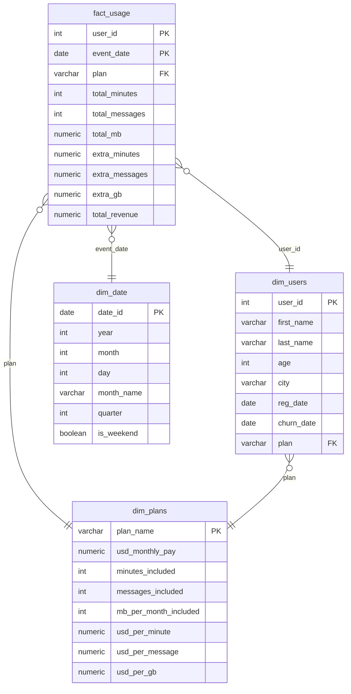

# Diagrama ERD — Capa Gold (Star Schema)

```mermaid
erDiagram
  fact_usage {
    int user_id PK
    date event_date PK
    varchar plan FK
    int total_minutes
    int total_messages
    numeric total_mb
    numeric extra_minutes
    numeric extra_messages
    numeric extra_gb
    numeric total_revenue
  }

  dim_users {
    int user_id PK
    varchar first_name
    varchar last_name
    int age
    varchar city
    date reg_date
    date churn_date
    varchar plan FK
  }

  dim_plans {
    varchar plan_name PK
    numeric usd_monthly_pay
    int minutes_included
    int messages_included
    int mb_per_month_included
    numeric usd_per_minute
    numeric usd_per_message
    numeric usd_per_gb
  }

  dim_date {
    date date_id PK
    int year
    int month
    int day
    varchar month_name
    int quarter
    boolean is_weekend
  }

  fact_usage }o--|| dim_users : "user_id"
  fact_usage }o--|| dim_plans : "plan"
  fact_usage }o--|| dim_date : "event_date"
  dim_users  }o--|| dim_plans : "plan"
```